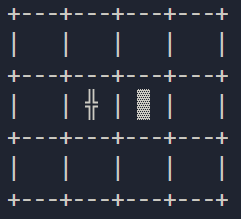

# Práctica de Programación - Matrices y Funciones
## Programa de Ingeniería Aeronáutica
### Escuela de Ingenierías
### Universidad Pontificia Bolivariana, Medellín  

---  
Preparado por:  
Jean Paul Sierra  
Henry Andrade Caicedo, Ph.D.

---
# Instrucciones
1. Ingrese a la carpeta `src`
2. Edite el archivo `praticaMat.py`
3. En la parte superior del archivo desarrolle sus funciones
4. Cree los commits que sean necesarios y realice push para subir los cambios al repo
5. No está permitido el acceso a otras aplicaciones o páginas web

# Problema: Algoritmo de navegación para un dron en un espacio 2D
En el laboratorio de control de vehículos no tripulados de una empresa, se quiere lograr que un dron pueda moverse en un espacio con obstáculos hasta estar dentro de cierta región. El espacio está representado como se observa en la figura 1, mediante una lista de listas (una matriz).
<figure>
  
  <figcaption>Figura 1. Diagrama que representa la matriz con el dron y un obstáculo</figcaption>
</figure> 

La cruz “╬” en la matriz representa la posición actual del dron y “▓” representa un obstáculo. Como Ingeniero de control, debes implementar un algoritmo que consiga que el dron llegue hasta la última fila de la matriz evitando el obstáculo. La posición del dron y la del objeto son aleatorias.

> **Los símbolos usados para representar el dron y el obstáculo se pueden cambiar**

## Evaluación
-	Desarrolla una función llamada `encontrarElemento(matriz, elemento)` que recibe como parámetros la matriz 3x4 y el símbolo usado pare representar el elemento (dron). Determina y retorna la posición del dron (posición inicial, fila y columna). **(Valor 1.0)**
-	Desarrolla una función llamada `moverDron(matriz, fila, columna)`, para hacer que el dron se mueva correctamente de forma horizontal o vertical (**NO diagonal**) a una posición válida (da un paso), sin importar la posición de inicio. La función recibe la matriz 3x4 y la posición actual del dron. Debe retornar la posición de la nueva ubicación del dron. **(Valor 3.0)**
-	Implementa una función llamada `destinoFinalDron(matriz, fila, columna)`que verifica si el dron llegó a la última columna, no importa en qué fila. La función recibe la matriz 3x4 y la posición actual del dron. Debe retornar True si llegó a la última columna o False, si aún no lo ha logrado. (Valor 1.0)
-	Bonificación: Implementa la función time.sleep() para visualizar cada paso que da el dron de forma que permita apreciar las transiciones. Se debe mostrar cómo avanza el dron de una posición a otra, con un tiempo de retardo de un segundo (Valor 1.0) 
